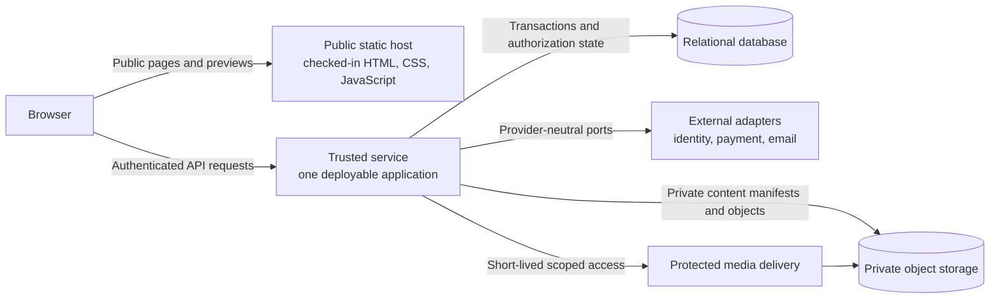
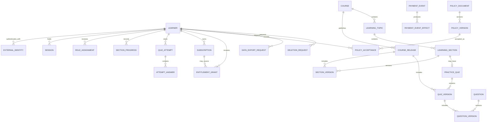
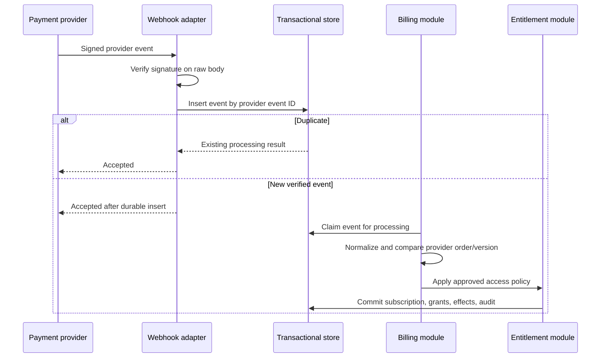

# Paid learning service architecture draft

Status: Architecture recommendation for the paid service. The [Supabase database foundation](supabase-database-design.md) is implemented and verified in development. The local account gateway/UI is implemented; live provider setup, production hosting, payments, subscriptions, and private media remain future work.

This draft prepares the current public course preview for a future paid learning service without choosing providers, prices, commercial policies, or legal retention rules. It refines the future work recorded in the [README roadmap](../../README.md#todo). [PRODUCT.md](../../PRODUCT.md) remains the source for shipped product scope, [CONTEXT.md](../../CONTEXT.md) remains the source for current course terms, and [docs/ARCHITECTURE.md](../ARCHITECTURE.md) remains the source for today's static learning-content and media seams.

## Decision summary

The [2026-09-23 product decisions and setup brief](paid-service-start.md) resolve part of the owner decisions below: both free and paid learning content require an account; paid access renews monthly in ILS; cancellation preserves access through the paid period; sign-in supports email/password and Google; and expiration does not delete progress. The price and payment provider remain undecided. Supabase Free is the selected development environment, with its first database migration applied. The [local session gateway design](session-gateway-design.md) specifies browser authentication. It does not make the static preview account-protected.

Keep the checked-in site as a directly served public frontend in plain HTML, CSS, and JavaScript. Add one separately deployed trusted service for account, progress, billing, entitlement, and protected-content operations. Back that service with one transactional relational database and private object storage. Isolate external identity, payment, email, and media-delivery systems behind adapters.

Start with one modular service, not independent microservices. Account, subscription, entitlement, and progress changes need transactional rules and a shared authorization decision. Keeping them in one deployable service reduces partial failures while the expected load and operating team are still unknown. Module boundaries should make a later split possible, but a split is not a first-release requirement.

The key ownership rule is simple: the static site may present public information and request actions, but only the trusted service may authenticate a learner, change learner state, accept billing facts, calculate access, or issue access to private content.

## Current and future boundaries

Today, the repository publishes checked-in static pages, including a public welcome page and a noindex course preview. The preview content is still publicly retrievable. It has no accounts, grading, persistent progress, payment, subscription, or protected media. A noindex directive, a hidden link, or client-side JavaScript cannot turn an existing public file into paid content.

The future system keeps the no-build public site intact:



The public host owns public pages, public preview assets, progressive enhancement, and fallbacks when JavaScript or the trusted service is unavailable. Serving these files must continue to require no runtime build step.

The trusted service owns HTTP boundary validation, sessions, authorization, learner data, progress, quiz attempts, subscription projections, entitlement decisions, webhook processing, content-release state, export and deletion workflows, and audit records. Internal modules share a transaction boundary where a command changes related records.

Private storage owns paid lesson bodies, private answer data, release manifests, protected downloads, and protected media originals or renditions. Objects are private by default. The browser receives an object only through an authorized service response or a short-lived scoped delivery grant.

External adapters translate provider payloads into internal commands and translate internal requests into provider calls. Domain records never use a provider event name or SDK type as their primary state.

### Module map

The first implementation should keep these modules inside one service:

| Module | Owns | Does not own |
| --- | --- | --- |
| Identity and sessions | External identity links, session issue/revocation, reauthentication facts | Learner access, subscription meaning |
| Learners and roles | Learner lifecycle, staff role assignments | Login credentials held by an identity provider |
| Learning records | Section progress, quiz attempts, concurrency rules | Published teaching content |
| Content catalog | Stable content IDs, immutable versions, releases, private asset references | Learner completion or billing |
| Billing | Checkout intent, normalized subscription state, payment-event inbox, reconciliation | Access to course content |
| Entitlements | Effective access decisions and grant history | Provider-specific billing interpretation |
| Policy acceptance | Accepted policy versions and evidence | Policy text authoring or legal sufficiency |
| Privacy operations | Export and deletion request state machines | Retention periods or legal eligibility decisions |
| Audit | Append-only sensitive-operation records | Application logs or payment payload archives |

Dependencies point toward provider-neutral domain commands. HTTP, database, identity, payment, email, and object-storage types stop at their adapters.

## Identity, sessions, and roles

A `Learner` is the local owner of progress, attempts, subscriptions, and entitlements. It is not an identity-provider user record. `ExternalIdentity` links a learner to a verified issuer and subject. The pair `(environment_id, issuer, subject)` is unique. Email addresses and other provider claims may change and must not become learner identifiers or authorization keys.

The identity adapter authenticates credentials or identity assertions. The trusted service then issues its own session. Prefer an opaque random session token in a `Secure`, `HttpOnly` cookie. Store only a keyed hash of the token, its learner, authentication time, expiry, and revocation state. Rotate the token after authentication and privilege changes. Revoke sessions on account security events and allow server-side expiry independent of the external identity provider.

If the chosen identity system requires browser redirects, use state and nonce validation and proof key exchange where supported. Redirect destinations must resolve through a server-owned allowlist. A request-supplied absolute return URL is never accepted.

Roles grant operational permissions. A learner does not need a role assignment to access their own records. Staff roles should start with the smallest set the approved operating model needs, drawn from `support`, `content_editor`, and `billing_operator`. If one person needs more than one responsibility, assign multiple roles rather than creating a broad `admin` shortcut. The exact role set remains an owner decision.

Every protected operation checks both action permission and resource scope. Knowing a learner ID, attempt ID, asset ID, or subscription ID never grants access. Learner-facing routes should prefer `/me` resources so callers cannot select an account accidentally. Staff operations must record the actor, reason, target, and result in the audit log.

## Stable learning identity and versioning

Paths, Hebrew headings, HTML anchors, and display order may change. They are presentation attributes, not durable database keys. The future catalog needs immutable identifiers for these concepts:

| Concept | Stable identity | Versioned data |
| --- | --- | --- |
| Course | `course_id` | Title, description, availability metadata |
| Learning topic | `topic_id` | Display name, summary, order within a release |
| Learning section | `section_id` | Body, media references, completion definition reference |
| Practice quiz | `quiz_id` | Instructions, question order, grading-policy reference |
| Question | `question_id` | Prompt, choices, answer key, explanation, media references |
| Media asset | `asset_id` | Rendition manifest, captions, transcript, content hash |
| Course release | `release_id` | Exact set of topic, section, quiz, question, and asset versions |

Use opaque, non-recycled IDs. A slug may be readable and stable in practice, but it remains a route alias. Renaming or moving a page changes its slug mapping without changing its domain ID. Each version also has its own opaque ID and immutable content hash. A published version is never edited in place. Corrections create new versions and a new release.

Current section anchors and question element IDs are useful authoring identifiers within their files. They are not yet a global versioned catalog. A future publishing tool should require explicit stable IDs, check uniqueness across the complete course, and reject missing references before it uploads private content.

Progress records refer to `section_id` plus the last observed `section_version_id`. Quiz attempts refer to an immutable `quiz_version_id`; answers refer to the `question_id` and `question_version_id` presented in that attempt. A content correction therefore cannot silently change the questions attached to a submitted attempt.

## Provider-neutral data model

This is a logical model. Table names and storage-specific types may change during implementation, but the identities and constraints should survive those choices.



### Core records and constraints

| Record | Required data | Important constraints |
| --- | --- | --- |
| `Learner` | `learner_id`, lifecycle state, created/updated timestamps | Lifecycle is an explicit state, not several booleans. Deleted IDs are never reused. |
| `ExternalIdentity` | `external_identity_id`, `learner_id`, environment, issuer, subject, verified claim snapshot | Unique environment/issuer/subject. A link belongs to one learner. Mutable claims do not change ownership. |
| `Session` | Hashed token, `learner_id`, issued/authenticated/expires timestamps, optional revocation fact | Expiry follows issue time. A revoked or expired session cannot be revived. Raw tokens are never stored or logged. |
| `RoleAssignment` | Actor, role, scope, granted/revoked timestamps, granting actor | A live assignment is unique per actor/role/scope. Staff cannot grant permissions they do not hold. |
| `Course`, `LearningTopic`, `LearningSection`, `PracticeQuiz`, `Question`, `MediaAsset` | Opaque stable ID and lifecycle metadata | IDs are immutable and never recycled. Deactivation does not delete referenced history. |
| `CourseRelease` | `release_id`, `course_id`, release number, state, manifest hash, timestamps | Release number is unique within a course. Only a validated draft can publish. Published content is immutable. One current release per course/environment. |
| Version records | Stable parent ID, opaque version ID, content hash, release linkage, private object reference where needed | Unique parent/version pair. Object hash must match publication manifest. Published versions cannot mutate. |
| `SectionProgress` | `learner_id`, `section_id`, last observed version, progress payload, completion state, revision, timestamps | Unique learner/section. Revision increases on every accepted write. Completion rules are versioned and remain pending. |
| `QuizAttempt` | `attempt_id`, `learner_id`, immutable quiz version, state, start/submission timestamps, revision | State is `in_progress`, `submitted`, or `abandoned`. A submitted or abandoned attempt cannot receive answers. |
| `AttemptAnswer` | `attempt_id`, question and question-version IDs, selected choice ID, revision, timestamp | Unique attempt/question. Choice must belong to the recorded question version. Never accept correctness or score from the client. |
| `Subscription` | `subscription_id`, `learner_id`, provider reference mapping, normalized state, observed provider version/time, period facts when supplied | External reference is unique per environment/provider. Old events cannot overwrite a newer authoritative observation. Subscription state never authorizes content directly. |
| `EntitlementGrant` | `entitlement_id`, `learner_id`, access scope, source type/reference, state, start/end facts, revision | Scope uses stable course or section IDs. End follows start. Revocation is explicit and audited. Several grants may support one effective access decision. |
| `CheckoutIntent` | Learner, immutable offer version, state, idempotency key, provider checkout reference, expiry | One logical checkout per learner/offer/idempotency key. Amount and provider product references come only from the trusted offer version. |
| `PaymentEvent` | Environment/provider/event ID, payload hash or protected payload reference, received time, verification result, processing state, attempts, error code | Unique environment/provider/event ID. Only verified events reach billing commands. Processing is resumable and idempotent. |
| `PaymentEventEffect` | Event ID, command name, aggregate ID, outcome, timestamp | Unique event/command/aggregate combination. Replays return the recorded outcome. |
| `ReconciliationCase` | Subscription, provider observation, local observation, state, detected/resolved timestamps | One open case per subscription and mismatch kind. Repairs use normal billing commands and retain their correlation ID. |
| `IdempotencyRecord` | Environment, actor, operation, key, request hash, response status/body reference, expiry | Unique environment/actor/operation/key. A different request hash can never reuse the result. |
| `PolicyDocument` and `PolicyVersion` | Stable policy ID, immutable version ID, locale, content hash, effective facts | Published versions are immutable. Policy type is not inferred from a URL. |
| `PolicyAcceptance` | Learner, policy version, accepted time, evidence allowed by approved privacy policy | Unique learner/policy version. A new policy version needs a new acceptance only when the approved policy says so. |
| `AuditRecord` | Immutable ID, actor, action, target, result, request/correlation ID, timestamp, redacted change summary | Append-only. No secrets, session tokens, raw card data, or unnecessary private content. |
| `DataExportRequest` | Learner, state, requested/started/completed/expired facts, artifact reference | Explicit state machine. Generated artifacts stay private and expire under the approved policy. |
| `DeletionRequest` | Learner, state, request/verification/execution facts, blocking reason code | Explicit state machine. Execution follows a policy-owned data disposition map rather than deleting every table blindly. |

Database constraints should enforce uniqueness, foreign keys, valid timestamps, and legal state transitions where practical. Application commands own rules that span aggregates or external facts. All timestamps use UTC instants; presentation applies the learner's display locale and timezone later.

State values should remain small and provider-neutral. A learner can be `active`, `suspended`, `deletion_pending`, or `deleted`. A subscription can be `pending`, `active`, `delinquent`, `cancel_scheduled`, `ended`, or `disputed`. These subscription states describe billing observations and do not decide access. An entitlement grant can be `scheduled`, `active`, or `revoked`; expiry is derived when its approved end time passes. Mapping provider states into these values belongs to the payment adapter, while transitions and access consequences belong to the billing and entitlement modules.

### Subscription and entitlement separation

`Subscription` is the local record of a commercial relationship as reported by the approved payment adapter. `EntitlementGrant` is the local authority for access. This separation is deliberate. A refund, dispute, grace period, manual correction, delayed webhook, or future non-subscription purchase can change access without pretending that provider state and course access are the same concept.

A provider event updates the subscription projection through a normalized billing command. An access-policy function then evaluates the approved rules and creates, changes, or revokes entitlement grants in the same local transaction. Those policy rules remain unimplemented until the owner decides access periods, cancellation, refunds, failed-payment grace, disputes, return access, and any non-subscription offers.

The authorization query is provider-neutral:

```text
canAccess(learner_id, resource_scope, current_time)
  -> allowed with entitlement_id and decision_version
  -> denied with an internal reason code
```

The public response does not expose provider state or sensitive denial details. Every content and media path calls the same entitlement decision. UI visibility is only a convenience.

## Billing events, retries, and reconciliation

Webhook delivery is at least once, may be delayed, and may arrive out of order. Processing must assume duplicates and partial failures.



The webhook adapter validates the signature against the exact raw request bytes, records the environment, provider, external event ID, receive time, and payload hash, then durably inserts the event. Invalid signatures are rejected and never enter domain processing. Duplicate external event IDs return the original accepted result without repeating effects.

The processor claims durable inbox rows with a lease or row lock. It records each effect in the same database transaction as subscription and entitlement updates. A crash before commit leaves no effect. A crash after commit can replay safely because the event effect already exists. Retry scheduling uses bounded exponential delay and a terminal review state; exact limits are operating decisions.

Do not rely on webhook arrival order. The adapter should extract a provider sequence, object version, or effective timestamp when one exists. If an event cannot be ordered safely, retrieve the provider's current subscription state through the adapter and apply that snapshot. A checkout success redirect only prompts the browser to poll the trusted service. It never activates a subscription or entitlement.

A scheduled reconciliation job compares local subscription projections with provider snapshots for active or recently changed records. It records mismatches as `ReconciliationCase` items and repairs them by calling the same idempotent billing commands used by webhooks. Operators may inspect and retry a case, but direct database edits are not an operational interface.

Checkout creation also uses idempotency. The browser submits an approved `offer_id`, never an amount, currency, access period, or provider product ID. The trusted service loads the server-owned offer version, binds the checkout intent to the authenticated learner, and passes an internal correlation reference through the adapter. Commercial offer records cannot be finalized until the owner approves plans and pricing.

Payment collection should use a provider-hosted page or provider-supported secure components. Raw card details must not reach the static site, trusted service, application logs, or database.

## API contract

The exact domain and deployment platform remain open. The contract below defines responsibility and behavior, not framework syntax.

### Learner-facing resources

| Method and path | Purpose | Concurrency and retry rule |
| --- | --- | --- |
| `GET /v1/session` | Return signed-in state, learner summary, CSRF bootstrap, and permitted account actions | Safe to retry. Never returns private identity-provider tokens. |
| `POST /v1/session/logout` | Revoke the current session | Idempotent. A repeated call returns the signed-out state. |
| `GET /v1/me` | Return the learner's own supported profile data | Safe to retry. |
| `GET /v1/me/progress` | Return progress for accessible sections | Safe to retry. Filters by authenticated learner on the server. |
| `PUT /v1/me/sections/{section_id}/progress` | Set an absolute progress state | Requires an expected revision or `If-Match`. A stale write returns `412`. |
| `POST /v1/me/quiz-attempts` | Start an attempt against the current entitled quiz version | Requires `Idempotency-Key`. Response identifies the immutable quiz version. |
| `PUT /v1/me/quiz-attempts/{attempt_id}/answers/{question_id}` | Set one selected choice | Ownership and attempt state checked. Requires expected revision. |
| `POST /v1/me/quiz-attempts/{attempt_id}/submission` | Submit once for server-side grading when grading exists | Requires `Idempotency-Key`. Replays return the first result. |
| `GET /v1/me/subscription` | Return normalized billing facts approved for learner display | Safe to retry. Provider-private fields omitted. |
| `POST /v1/checkout-sessions` | Create or reuse checkout for an approved offer | Requires `Idempotency-Key`. Server loads price and provider references. |
| `POST /v1/me/subscription/cancellation` | Request cancellation under the approved policy | Requires reauthentication when policy demands it and an idempotency key. |
| `GET /v1/content/releases/current` | Return the entitled release manifest and public route aliases | Authorization precedes response. Private responses use non-public cache policy. |
| `GET /v1/content/sections/{section_id}` | Return an entitled section version | Authorization checks the stable ID, not the referring page. |
| `POST /v1/media-access` | Issue short-lived access for an entitled `asset_id` and rendition | Requires entitlement on every call. Requested paths and buckets are never accepted. |
| `POST /v1/me/data-exports` | Start or reuse an export request | Idempotent while a matching request is active. |
| `POST /v1/me/deletion-requests` | Start the approved deletion workflow | Requires recent authentication and explicit verification. |

Webhook and staff paths live in separate route groups with separate authentication policies. Payment webhooks use provider signature verification, not browser sessions. Staff routes require staff authentication, role and scope checks, recent authentication for sensitive changes, and audit reasons.

### Errors and request correlation

Every error response has one stable shape:

```json
{
  "error": {
    "code": "progress_revision_conflict",
    "message_key": "progress.revision_conflict",
    "request_id": "opaque-request-id",
    "retryable": false,
    "details": {}
  }
}
```

`code` is a stable machine value. `message_key` lets the Hebrew client choose reviewed copy without making API prose part of the contract. `request_id` ties the response to redacted logs and audit records. `details` contains only field-level data safe for the current actor.

Use standard status meanings consistently: `400` for malformed transport input, `401` for no valid session, `403` for a known action the actor cannot perform, `404` when a private resource is absent or must not be disclosed, `409` for a domain-state conflict, `412` for a stale revision, `422` for valid syntax that violates a domain rule, `429` with `Retry-After` for rate limits, and `503` with `Retry-After` for temporary service unavailability. Never vary login or recovery responses in a way that confirms whether an account exists.

Clients may retry safe reads and absolute-value writes after network failure. Create or transition commands require an idempotency key. Store keys by environment, actor, operation, and request hash. Reusing a key with a different request returns `409`; reusing it with the same request returns the original status and body. The retention time for idempotency records is an operating decision, but it must exceed all supported client and provider retry windows.

### Browser origin and CSRF boundary

If browser sessions use cookies, every state-changing browser request must pass all of these checks:

- The session cookie is `Secure`, `HttpOnly`, host-scoped where possible, and uses an approved `SameSite` mode.
- The `Origin` header matches an exact production or staging allowlist. Missing or unexpected origins fail closed on unsafe methods.
- The request has a session-bound CSRF token in a custom header. The service compares it in constant time.
- The request content type is an allowed JSON type. Simple cross-origin form submissions do not reach mutation handlers.
- Cross-origin credentials, if the final domain design needs them, use an exact origin and `Vary: Origin`. Wildcard credentialed CORS is forbidden.

Webhook routes do not use browser CSRF tokens. They accept only the provider-specific method and content type, verify the signature on the raw body, enforce size and rate limits, and use their own replay controls.

All boundary payloads are parsed into internal types once. Internal modules receive validated IDs, states, and timestamps rather than raw JSON or provider objects.

## Protected content and media delivery

The current public files stay public. Any text, answer key, manifest, or media that must require payment must not be committed under a publicly deployed path or embedded in public JavaScript.

For small private lesson bodies and answer data, the trusted service should read the authorized immutable version and return it directly with `Cache-Control: private, no-store` unless a later reviewed cache design proves safe. The service never sends answer keys as part of an in-progress quiz payload.

For large media, the trusted service checks the session and entitlement, resolves the requested `asset_id` to a server-owned object key and rendition, and issues a short-lived bearer delivery grant, such as a signed URL or signed cookie. The grant is limited to one asset or a narrow path, one environment, and the shortest duration compatible with playback. The object store rejects anonymous reads. Public URLs, predictable object keys, referer checks, and unscoped CDN origins are not access control.

The bearer grant authorizes whoever possesses it until its expiry or a supported revocation boundary. It does not prevent a learner from copying the complete grant during that window. Keep the window short and never expose grants in logs, referrers, analytics, or public HTML. If a later approved requirement forbids that transfer window, replace bearer delivery with a session-bound mechanism that checks the learner binding on every request.

Protected-cache keys must include the grant or use a delivery mechanism that validates it before serving a cached object. An unsigned request or a request with a different or invalid grant must not retrieve a cached protected response. Logs record the stable asset and decision ID, not the signed URL.

## Content publication from preview to paid release

Public preview publishing and private release publishing remain separate processes:

1. Authors keep public descriptions and approved free samples in the checked-in static pages. Existing no-JavaScript behavior remains available.
2. An offline publication tool reads approved course source, requires explicit stable IDs, and builds an immutable release manifest. This tool may run in CI or a controlled operator environment; it does not become a build step required to serve the public site.
3. Validation checks global ID uniqueness, references, question-choice relationships, public/private classification, media existence, content hashes, and the instructor-approval record.
4. The tool uploads private objects to a staging namespace and creates a draft `CourseRelease`. Uploading does not make the release visible.
5. Staging exercises the exact manifest and object hashes. An authorized content publisher records approval and atomically moves the course's current-release pointer to the validated release.
6. Rollback moves the pointer to an earlier intact release. Published objects remain immutable while any progress, attempt, acceptance, or audit record references them.

The public/private classification is release metadata owned by the content catalog. The owner still must decide which topics and samples are public. Publication must reject a private object referenced by a public static page and a public object that contains private answer data.

## Migrations, environments, and recovery

Run schema migrations as versioned, reviewed artifacts from the service deployment pipeline. Record each migration name, checksum, start/end time, and outcome in a migration ledger. Use expand, migrate, contract changes when more than one application version may run during a deployment. Backfill in resumable batches with checkpoints. A failed backfill can continue without repeating completed work.

Before a destructive migration, take a restorable backup and prove the actual backup in a restricted recovery environment. Deployment rollback and data rollback are separate procedures. Application code may roll back while a compatible expanded schema remains. Dropping columns or rewriting referenced content waits until backups, export obligations, retention policy, and the old application version no longer require the data.

Production and staging use separate databases, private buckets, external-provider environments, encryption keys, webhook secrets, domains, and email destinations. Never copy live learner or payment data into staging. Use synthetic fixtures. Environment identity is part of every external-reference uniqueness key so test and live events cannot collide.

The recovery environment is separate from ordinary staging. Create it only for an authorized restore drill, apply production-equivalent data access restrictions, disable public traffic and external side effects such as email, webhooks, and provider writes, collect only redacted verification evidence, then destroy it under an approved procedure. A sanitized dataset may test migrations in staging, but that is not proof that the actual production backup can be decrypted and restored. The owner still must decide the recovery environment's permitted location, lifetime, and operator access.

Secrets live in the deployment platform's managed secret store, not this repository, static JavaScript, content manifests, logs, database rows intended for staff display, or CI artifacts. Assign secrets to the smallest runtime identity that needs them. Record an owner and rotation procedure for session signing, encryption, webhook, provider API, email, database, and storage credentials. Rotation must support an overlap window when a protocol needs old keys to verify existing material.

Back up the relational database and private content catalog on schedules chosen from recovery objectives. Version or otherwise protect private objects against accidental overwrite and deletion. A recovery test must restore the database and its matching release/object set into the restricted recovery environment, verify hashes and referential integrity, and exercise side-effect-free health checks plus authorized content access. The owner still must approve recovery objectives and backup retention.

## Export, deletion, and unresolved retention rules

The technical design can support privacy operations before the owner settles policy:

- A data inventory maps each record and object class to its owner, sensitivity, export representation, deletion action, and policy authority.
- Export runs as an authenticated asynchronous state machine. It reads a consistent learner-scoped snapshot, emits a documented portable format with stable IDs and timestamps, stores it privately, and issues a short-lived download after reauthentication.
- Deletion runs as a verified asynchronous state machine. It first evaluates policy-owned blockers such as an active commercial relationship, dispute, legal hold, or required billing record. The actual blocker rules remain pending.
- A disposition map chooses `delete`, `anonymize`, `retain`, or `detach` per data class. This keeps legal and commercial policy out of table-specific scripts.
- Deletion revokes sessions and private-content access at the approved point, removes external identity links when allowed, and leaves only the minimum non-identifying tombstone needed to prevent accidental relinking or replay.
- Billing evidence, audit evidence, payment payloads, backups, and published learning history need explicit retention decisions. Until those decisions exist, the system must not promise immediate or complete erasure.
- Backup expiry follows the approved schedule. Restoring a backup must reapply completed deletion tombstones before the environment can serve traffic.

Export and deletion jobs are idempotent, resumable, observable, and auditable. Operators use supported commands, never manual multi-table deletion.

## Observability and audit

Use structured logs and metrics with request and correlation IDs. Redact cookies, authorization headers, identity assertions, signed media URLs, webhook secrets, raw card data, and unnecessary content. Separate operational logs from the append-only audit record.

Monitor session failures, authorization denials, progress conflicts, checkout creation, webhook verification and processing, event backlog age, reconciliation mismatches, media-grant failures, export/deletion job state, database migration state, and backup/restore results. Alert ownership and thresholds remain operating decisions.

Audit records cover staff account access, role changes, identity relinking, session revocation by staff, entitlement overrides, refund/dispute commands, policy publication, course publication or rollback, exports, and deletion decisions. Learner progress reads do not need a permanent audit record unless an approved requirement says otherwise.

## Acceptance tests for the architecture

These tests define security and consistency outcomes for the complete paid service. The database and local account suites cover the implemented subset; billing and protected delivery checks remain future work.

### Account and authorization isolation

- Sign in as learner A. Requests that substitute learner B's progress, attempt, subscription, export, deletion, or content identifiers return the same denied result as an unknown private identifier and reveal no B data.
- Submit B's attempt ID through A's `/me` route. The service does not update, submit, or confirm the existence of B's attempt.
- Give a support actor read-only learner scope. Billing, role, content publication, and entitlement-override mutations remain denied and create no side effects.
- Revoke a session and replay its cookie on another device. Every protected endpoint rejects it.
- Try unapproved redirect destinations through sign-in, checkout return, and recovery flows. The service resolves only allowlisted local destinations.

### Direct content and media access

- Request a paid section by stable ID while signed out and while signed in without entitlement. The service returns no body, manifest, answer data, object key, or useful existence difference.
- Fetch the private object-store URL without a delivery grant. Storage denies it.
- Use learner A's media grant after expiry, outside its asset scope, in the wrong environment, and after any supported revocation boundary. Delivery denies each request.
- Warm a cache with A's valid grant, then request the protected object without a grant and with a different invalid grant. Neither request receives A's cached object. Copying A's complete unexpired bearer grant is expected to work within its scope and lifetime; a session-bound delivery design is required if that transfer window is unacceptable.
- Inspect every public deployment artifact and source map. No private lesson body, answer key, storage credential, provider secret, or private manifest is present.

### Progress and attempts

- Send two progress writes from the same revision on different devices. One succeeds; the stale write receives `412` with the current safe revision and does not erase the first write.
- Retry a successful absolute progress write after losing the response. The stored state and revision do not advance twice.
- Start a quiz attempt twice with one idempotency key. Both responses identify one attempt and one quiz version.
- Publish a corrected question version while an attempt is active. The attempt continues to use its recorded version; a new attempt uses the new release.
- Try to submit a client-provided score or correctness flag. Boundary parsing rejects it or ignores it, and only server-owned answer data can calculate a result.

### Billing and entitlement

- Replay the same verified payment event concurrently. One event inbox row and one set of effects exist.
- Deliver renewal, cancellation, and failure events out of order. The final subscription projection matches the authoritative provider snapshot, and stale events do not restore older state.
- Return from checkout with a forged success query before any verified billing fact exists. No entitlement is granted.
- Crash after event receipt and before effect commit, then retry. Processing resumes and applies the effect once.
- Crash after effect commit and before acknowledging internal completion, then retry. The recorded effect is returned without a second grant or audit mutation.
- Create a provider/local mismatch and run reconciliation twice. The first run repairs it through the normal command; the second reports agreement without another change.

### Origins, lifecycle, and operations

- Send a cookie-authenticated mutation from an unapproved origin, without a CSRF token, and with a simple form content type. Each request fails before domain code runs.
- Send the same valid idempotency key with a changed request body. The service returns `409` and preserves the original result.
- Restore an actual encrypted production backup in the restricted recovery environment with public traffic and external side effects disabled. Migration checks, release hashes, private-object references, completed-deletion tombstones, and an entitled media request all verify. Destroy the environment under the approved procedure after collecting redacted evidence.
- Request an export twice while one is active. One job runs, and only the authenticated learner can retrieve the expiring result.
- Pause a deletion on every unresolved policy blocker. No partial multi-table deletion occurs; retry resumes from the recorded state after an authorized decision.
- Disable JavaScript or make the trusted service unavailable. Public navigation and public topic descriptions from the current static site remain readable.

## Alternatives considered

### Separate identity, billing, learning, and content services

This gives each area an independent deployment, but the first paid release would pay for distributed transactions, service authentication, event consistency, more deployment pipelines, and harder local testing. There is no measured scale or team boundary that justifies those costs. Keep internal modules and durable event seams so a later split has evidence to follow.

### Put the entire site behind a dynamic application

This can make same-origin sessions and protected routes straightforward, but it would replace the current direct static publication path and expand the outage area for public learning content. The public site already has tested no-JavaScript behavior and no-build serving. Preserve it and move only trusted operations and private content to the service boundary.

### Store access directly on subscription state

This has fewer records, but it couples every provider and commercial policy change to authorization. It cannot represent manual corrections, grace, non-subscription access, or overlapping grants cleanly. A separate entitlement model gives content authorization one provider-neutral owner.

### Stream every media byte through the trusted service

This centralizes checks, but it also makes the application responsible for large-file throughput and range requests. Use authorized short-lived delivery grants for large media, with direct service responses reserved for small private documents and answer data. Revisit this choice only if the selected delivery platform cannot enforce private origin access and safe cache behavior.

## Decisions still owned by the business and product owners

This architecture intentionally leaves these choices open:

- Which topics, sections, samples, answer explanations, and media are public or paid.
- Identity, payment, email, hosting, database, object-storage, and media-delivery providers.
- Public and service domains, same-site deployment, regional placement, and service availability targets.
- Supported sign-in and recovery methods, intended learner age range, and any consent requirements.
- Exact staff responsibilities and role assignments.
- What `viewed`, `in progress`, and `completed` mean for reading, video, and practice.
- Quiz scoring, feedback, retries, result visibility, and attempt-retention rules.
- Offers, currency, price, billing interval, renewal, trials, discounts, one-time purchases, plan changes, pauses, and taxes.
- Cancellation timing, refund handling, failed-payment grace, disputes, expired access, and progress on return.
- Policy versions that require acceptance and the evidence each acceptance may retain.
- Export contents, deletion eligibility, legal holds, retention periods, backup expiry, and billing/audit disposition.
- Recovery objectives, rate limits, idempotency retention, signed-media lifetime, monitoring thresholds, and support escalation.

Provider selection should follow these decisions and a documented evaluation of regional availability, business eligibility, Hebrew and RTL support, recurring billing needs, data handling, export, operational burden, and cost. Provider capabilities must not silently decide product policy.

## Implementation sequence after approval

This is sequencing guidance, not an implementation plan or authorization to build the service.

1. Resolve the minimum owner decisions for identity, public/private content, completion, subscription access, retention, and environments.
2. Turn the logical model and state transitions into versioned schemas and an API contract. Add threat modeling and qualified privacy, consumer, tax, and accessibility review where required.
3. Build environment, migration, secret, backup, and restore foundations before live learner data.
4. Implement identity/session and authorization with cross-account acceptance tests.
5. Add stable content publication and direct private-content/media denial tests.
6. Add progress and attempts with concurrency tests.
7. Integrate checkout, event inbox, normalized subscription state, entitlements, and reconciliation in provider test mode.
8. Add export, deletion, support operations, audit, monitoring, and recovery exercises.
9. Run the full public-to-paid acceptance suite and a controlled live billing lifecycle before enabling enrollment.

When any part ships, update `PRODUCT.md`, `CONTEXT.md`, `docs/ARCHITECTURE.md`, the README maintenance instructions, search/crawler metadata, and the public Hebrew copy to describe the real behavior. Course-start controls remain disabled, and profile controls keep their disabled fallback on static hosting. The configured local gateway enables account links without implying that enrollment is available.
